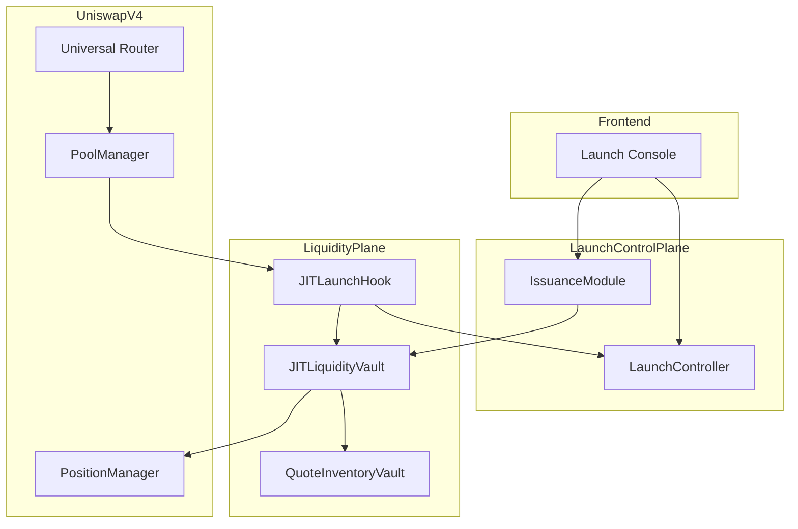
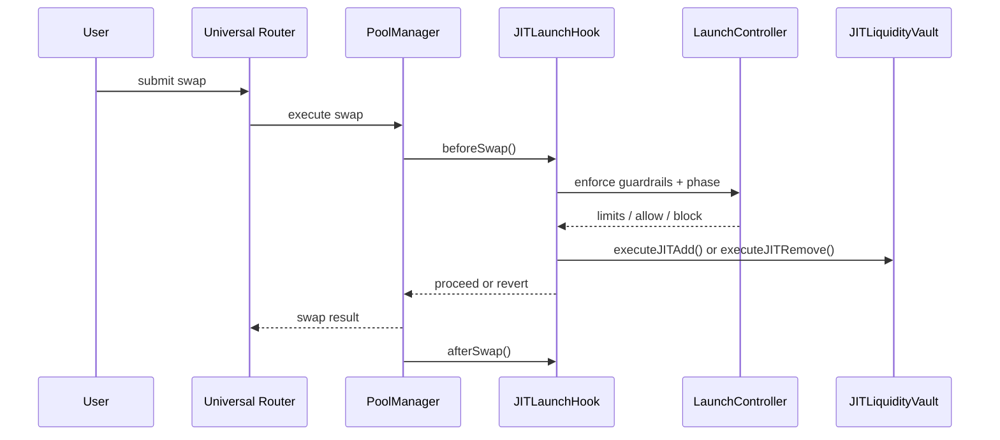

# JIT Liquidity & Issuance Hook


Integrated with **Unichain** and deployed on **Unichain Sepolia Testnet**.

## Description
JIT Liquidity & Issuance Hook is a launch-phase market primitive for Uniswap v4 that activates deterministic just-in-time liquidity at swap time, enforces anti-sniping guardrails during discovery, and transitions pools into steady state without keepers or bots required for correctness.

## Problem
New/illiquid token launches typically fail in the first minutes because:
- very thin early liquidity causes large slippage
- sniper and burst-MEV flows dominate first price prints
- one or two oversized swaps can set unhealthy anchor prices
- manual interventions or off-chain automation become operational risk

## Solution
This system enforces launch constraints directly in hook flow:
- deterministic pre-launch and discovery gating from `LaunchController`
- bounded JIT inventory actions from `JITLiquidityVault`
- quote-side custody and accounting with `QuoteInventoryVault`
- optional bounded issuance streaming via `IssuanceModule`
- deterministic phase transitions to steady-state behavior

The result is lower launch slippage, auditable constraints, and safer early price discovery.

## Integrations
Primary integration in this repo is **Unichain Sepolia**.

| Integration | Status | Address |
|---|---|---|
| Permit2 | Active | `0x000000000022D473030F116dDEE9F6B43aC78BA3` |
| PoolManager | Active | `0x00b036b58a818b1bc34d502d3fe730db729e62ac` |
| PositionManager | Active | `0xf969aee60879c54baaed9f3ed26147db216fd664` |
| SwapRouter (v4) | Active | `0x9cD2b0a732dd5e023a5539921e0FD1c30E198Dba` |

## Major Components
- `src/JITLaunchHook.sol`: swap-time guardrail enforcement and deterministic JIT triggers
- `src/LaunchController.sol`: launch config, phase schedule, update controls, anti-sniping policy
- `src/JITLiquidityVault.sol`: bounded add/remove inventory actions and accounting
- `src/QuoteInventoryVault.sol`: quote asset custody and pull-model funding
- `src/IssuanceModule.sol`: optional capped issuance stream into vault inventory
- `script/00_DeployLaunchStack.s.sol`: canonical deployment script
- `script/01_DemoCompare.s.sol`: baseline vs JIT demo lifecycle and comparison
- `frontend/`: launch console for config/deploy/demo UX

## Diagrams and Flowcharts

### User-Perspective End-to-End Flow


### Architecture Flow (Subgraph + Mermaid)


### Lifecycle Sequence


## Deployed Addresses + Tx URL Proof
Source of truth: [`deployments.md`](deployments.md)

### Unichain Sepolia Deployment (Core Stack)
| Contract | Address | Tx URL |
|---|---|---|
| LaunchToken (`MockNewAssetToken`) | `0x0ee3E3c313cD51e3C3B09e9831C1a84dFe89CC48` | https://unichain-sepolia.blockscout.com/tx/0xac22028fc32bb1ab72d5a613c40817a5408950f470d14b48986aa6b6c02ae1b7 |
| QuoteToken (`MockNewAssetToken`) | `0x180896366174318f5BD64d8320576A488400115a` | https://unichain-sepolia.blockscout.com/tx/0x174f434f1387ec708ddae573938c8c9bd901f903c852f360d3def581f75c05d9 |
| LaunchController | `0xd1819EfaC0a57E70BEa119727cE51b88191F3A70` | https://unichain-sepolia.blockscout.com/tx/0x9035f80ae606e57c7acebac0431f5c0d6979890f49a8fdd57f7585e20516795f |
| QuoteInventoryVault | `0x1C2A9aBe3d3a4FBaD2FA0c795c311E670CE792C6` | https://unichain-sepolia.blockscout.com/tx/0xca8865459c9a6802ff7315a5baab4d1bcd8f69873414a646b685377a09aa210b |
| JITLiquidityVault | `0x034e2BF5C2c91788E7E85170644c4fB79073888d` | https://unichain-sepolia.blockscout.com/tx/0xd052277e1cb66d7fb156abb7776a05166d360134ee127d21440102bcc63ec686 |
| IssuanceModule | `0x49d0C37CFbEFc27994e784BA542E4F1f6A1a892A` | https://unichain-sepolia.blockscout.com/tx/0x74a0f926ee88d3dfa67de40e5439363d42236cb471d5bd76d8c4e8c818f3224a |
| JITLaunchHook | `0x9146Bf7b6e8Ef3508AE74ec9C0d3E2d042D080C0` | https://unichain-sepolia.blockscout.com/tx/0xbb682d130478bb4f4a3a5993141859579755dd35fb24b26bf90cb5c73b4ca8c7 |

## Demo Run (Detailed, With Tx URLs)
Demo script: `script/02_DemoCompareExisting.s.sol:DemoCompareExistingScript`  
Latest successful broadcast: `broadcast/02_DemoCompareExisting.s.sol/1301/run-latest.json` (`run-1772869710206.json`, 2026-03-07)

This run is **existing-stack mode**:
- no contract deployments (`CREATE`) are performed
- contracts are loaded from `.env`
- tx list is strictly approvals + swap execution calls

### Demo Contracts (Latest Successful Run)
- Launch token0: `0x0ee3E3c313cD51e3C3B09e9831C1a84dFe89CC48`
- Quote token1: `0x180896366174318f5BD64d8320576A488400115a`
- LaunchController: `0xd1819EfaC0a57E70BEa119727cE51b88191F3A70`
- QuoteInventoryVault: `0x1C2A9aBe3d3a4FBaD2FA0c795c311E670CE792C6`
- JITLiquidityVault: `0x034e2BF5C2c91788E7E85170644c4fB79073888d`
- IssuanceModule: `0x49d0C37CFbEFc27994e784BA542E4F1f6A1a892A`
- JITLaunchHook: `0x9146Bf7b6e8Ef3508AE74ec9C0d3E2d042D080C0`

### Demo Outcome Snapshot
- Baseline avg execution price (1e18): `1156130977667181232`
- JIT avg execution price (1e18): `1116224157354681232`
- Baseline max slippage: `852 bps`
- JIT max slippage: `868 bps`
- Baseline blocked swaps: `0`
- JIT blocked swaps: `0`

### Latest Demo Tx URLs (All, With Explanations)
- Tx 0: token0 `approve` to Permit2 (allowance prep)  
  https://unichain-sepolia.blockscout.com/tx/0x1bec5e416a62dcc19d0e6958d685c8825455ed2a6d8cd732082020259c0dc945
- Tx 1: token0 `approve` to SwapRouter (direct swap allowance)  
  https://unichain-sepolia.blockscout.com/tx/0xccc56ce0c05e7c04970bd5df56bd44f94aa3f5e364cee5dccdaa59f956b64023
- Tx 2: Permit2 `approve(token0, PositionManager)`  
  https://unichain-sepolia.blockscout.com/tx/0xbcc8190e0128bfba05d6f9051a800fbc123abf5801fa6ed8029bc91166a64602
- Tx 3: Permit2 `approve(token0, PoolManager)`  
  https://unichain-sepolia.blockscout.com/tx/0x88db4c64570d868641ed825df6fc3fd3d5578ca9e3d0ae6de4cf9621ff27ff00
- Tx 4: token1 `approve` to Permit2 (allowance prep)  
  https://unichain-sepolia.blockscout.com/tx/0xedddfc0a6a68eb6a1b191c80473beebdb597e587b19b12b8ab08d280889d78c3
- Tx 5: token1 `approve` to SwapRouter (direct swap allowance)  
  https://unichain-sepolia.blockscout.com/tx/0x2eef7893f0243cc874aa9badb49d63bc1f487d9f7844eed10c9f5d9c4ebd5954
- Tx 6: Permit2 `approve(token1, PositionManager)`  
  https://unichain-sepolia.blockscout.com/tx/0x1df940a7b107d90ee3748fb66be91be28a99e131137cacec5ae79eb99c8e0a84
- Tx 7: Permit2 `approve(token1, PoolManager)`  
  https://unichain-sepolia.blockscout.com/tx/0x0599bc14606a200b45e3170ef8a175a814da6c638c383b6a718887833e995fcb
- Tx 8: baseline pool swap #1 (0.1 token0)  
  https://unichain-sepolia.blockscout.com/tx/0xdd020f37ac6299c136215674f1542a2cea9bb0553cfa2c599230d33ed18835a0
- Tx 9: baseline pool swap #2 (0.25 token0)  
  https://unichain-sepolia.blockscout.com/tx/0x64d06a180eb5647861e181d86ac840be50128af57775d498ee9a9768ad8582ce
- Tx 10: baseline pool swap #3 (0.5 token0)  
  https://unichain-sepolia.blockscout.com/tx/0x3fef10486fb608aba8f1c8a10b89d232e59a7e6cd22af96c5ea754bd458b97ba
- Tx 11: baseline pool swap #4 (0.75 token0)  
  https://unichain-sepolia.blockscout.com/tx/0xa742dc62fabb943175d92648056b5c1769bccdce768f3722fdb6e260dff2f414
- Tx 12: baseline pool swap #5 (1.0 token0)  
  https://unichain-sepolia.blockscout.com/tx/0xdfc182afa947c24dd54f1d617b5a486f3da588b2fde86f7178138024366115c3
- Tx 13: baseline pool swap #6 (2.0 token0)  
  https://unichain-sepolia.blockscout.com/tx/0xd4e4f4ea083fcb5c4db2aac5dcdc758839d8ff05a8ed73c784821ecb6222fa98
- Tx 14: JIT pool swap #1 (0.1 token0)  
  https://unichain-sepolia.blockscout.com/tx/0xb5dc08d2cb6b2eb664d70e9b53a9e95555b85f6e9a97a7b7878506b5326b67cd
- Tx 15: JIT pool swap #2 (0.25 token0)  
  https://unichain-sepolia.blockscout.com/tx/0x6ed262119a90cc07db6f4eac8d5cf5f081ffc1185718adf8fb21371d1f07f864
- Tx 16: JIT pool swap #3 (0.5 token0)  
  https://unichain-sepolia.blockscout.com/tx/0x5d4702438ea61459d3eb1a3739418312b913cedf42a706af307fa4d08f86ff34
- Tx 17: JIT pool swap #4 (0.75 token0)  
  https://unichain-sepolia.blockscout.com/tx/0x7fe0e6e8011e3a59901793e548682250a78b9c7e6140aa4615c49a2847dcc12a
- Tx 18: JIT pool swap #5 (1.0 token0)  
  https://unichain-sepolia.blockscout.com/tx/0xe200523b98cefad694e751e404e0bfbdaec449eb329b5b316f96531ee32a79c1
- Tx 19: JIT pool swap #6 (2.0 token0)  
  https://unichain-sepolia.blockscout.com/tx/0xbe3c913b3a5e1f1cddc5997f022b83d05e9c1f6cb3c87fe50ae00ca1b8de900c

To print every tx hash with explorer URLs:
```bash
./scripts/print_broadcast.sh script/02_DemoCompareExisting.s.sol 1301
```

## Run Commands
```bash
# bootstrap and build
make bootstrap
make build

# full tests
make test

# coverage summary report
make coverage

# local demos (anvil)
make demo-launch
make demo-compare
make demo-local

# Unichain Sepolia deploy stack (if needed) + existing-stack demo (no fresh deploy)
make deploy-sepolia
make demo-sepolia
```

## 100% Testing Brag + Coverage Proof
**100% test suite pass rate is currently achieved** (`34/34` passing).

Test categories present and passing:
- Unit tests: `test/JITLaunchHook.t.sol`, `test/JITLiquidityVault.t.sol`, `test/LaunchController.t.sol`
- Fuzz tests: `test/fuzz/JITFuzz.t.sol`
- Invariant tests: `test/invariant/JITInvariant.t.sol`
- Integration tests: `test/integration/LaunchLifecycle.t.sol`
- Utility/library tests: `test/utils/libraries/EasyPosm.t.sol`

Latest coverage summary (`forge coverage --report summary`):
- Lines: `48.35%` (`381/788`)
- Statements: `46.80%` (`387/827`)
- Branches: `30.00%` (`36/120`)
- Functions: `60.75%` (`65/107`)

High-signal contract coverage highlights:
- `LaunchController.sol` function coverage: `100%`
- `MockNewAssetToken.sol` line coverage: `100%`
- `JITLaunchHook.sol` line coverage: `86.67%`

## Future Roadmap
- Increase full-repo coverage gate toward 100% by adding script-path execution coverage and deeper branch tests
- Add richer launch policy presets (strict fair-launch, balanced discovery, fast transition)
- Expand benchmark harness across multiple volatility profiles and liquidity depths
- Add live dashboard mode in frontend for real-time guardrail/phase telemetry
- Add external audit package with formalized threat matrix and remediation checklist

## Documentation
- [Spec](spec.md)
- [Overview](docs/overview.md)
- [Architecture](docs/architecture.md)
- [JIT Model](docs/jit-model.md)
- [Launch Phases](docs/launch-phases.md)
- [Anti-Sniping](docs/anti-sniping.md)
- [Security](docs/security.md)
- [Deployments](docs/deployments.md)
- [Demo](docs/demo.md)
- [API](docs/api.md)
- [Testing](docs/testing.md)
- [Frontend](docs/frontend.md)
