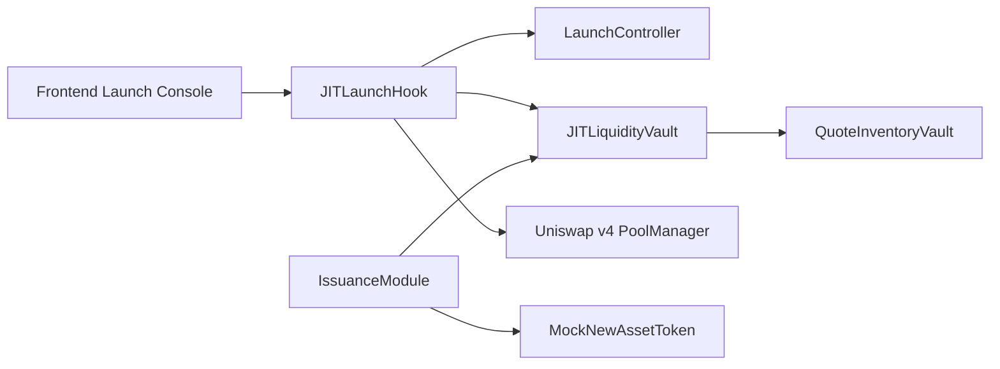

# Architecture

## Components
- `JITLaunchHook`: Uniswap v4 hook callbacks, guardrail enforcement entrypoint.
- `LaunchController`: per-pool config, phase machine, decaying constraints, per-block counters.
- `JITLiquidityVault`: deterministic inventory reservation/release model for JIT bands.
- `QuoteInventoryVault`: quote-side custody and reservation accounting.
- `IssuanceModule`: optional deterministic mint stream with hard caps.

## System Diagram

## Interaction Notes
- Hook entrypoints are `onlyPoolManager` via `BaseHook`.
- `LaunchController.enforceSwapGuardrails` executes first and can revert.
- JIT actions are bounded by `maxJitActionsPerBlock` and `maxInventoryUsagePerJit`.
- Steady-state swaps can trigger deterministic JIT unwind.
