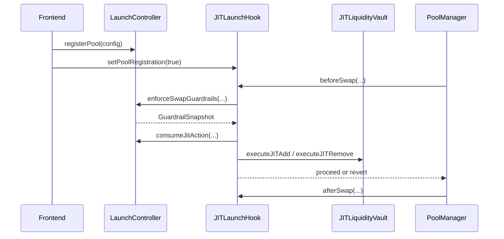

# JIT Liquidity & Issuance Hook Specification

## 1. Objective
Build a deterministic Uniswap v4 launch primitive that:
- improves early price discovery
- reduces initial slippage
- adds anti-sniping controls
- optionally streams bounded issuance into LP inventory
- does not depend on off-chain keepers for correctness

## 2. Core Contracts
- `JITLaunchHook`: hook callback entrypoint (`beforeSwap`, `afterSwap`).
- `LaunchController`: per-pool launch config, phase machine, guardrail enforcement, bounded governance updates.
- `JITLiquidityVault`: deterministic JIT inventory reservation/release around active tick.
- `QuoteInventoryVault`: quote-side custody and reservation accounting.
- `IssuanceModule` (optional): deterministic linear issuance stream with hard per-block and total caps.
- `MockNewAssetToken`: demo token with explicit minter list.

## 3. Deterministic Lifecycle
Phase derivation is block-based:
- `PreLaunch`
- `LaunchDiscovery`
- `SteadyState`

Transitions are fully deterministic from `startBlock`, `preLaunchBlocks`, and `launchBlocks`.

### Sequence

## 4. Guardrails
`LaunchController` enforces:
- max input size per swap (`maxAmountIn`)
- max impact threshold (`maxImpactBps`)
- optional allowlist window (`allowlistBlocks`)
- per-trader cooldown (`cooldownBlocks`)
- max swaps per block (`maxSwapsPerBlock`)
- max JIT actions per block (`maxJitActionsPerBlock`)

Discovery-phase relaxation uses linear interpolation:
- `maxAmountIn(t) = initial + (steady - initial) * progress`
- `maxImpactBps(t) = initial + (steady - initial) * progress`

where `progress = elapsed / launchBlocks`.

## 5. JIT Inventory Model
For active tick `t` and width `w`:
- `tickLower = t - w`
- `tickUpper = t + w`
- `usage = min(freeToken0, freeQuote, maxInventoryUsagePerJit)`

Add action:
- `free -> reserved` for both sides, bounded and constant-time.

Remove action:
- `released = reserved * releaseBps / 10_000`.

## 6. Issuance Model (Optional)
For each pool schedule:
- `maxTotal`
- `maxPerBlock`
- `startBlock`, `endBlock`

Mintability is vested linearly and capped per block.
No unlimited mint path exists.

## 7. Access Control
- Hook callbacks are `onlyPoolManager`.
- Swap/JIT enforcement entrypoints are restricted to the configured hook.
- Vault custody mutators are owner-gated.
- Issuance credit path is issuer-gated.
- Config updates are delayed and step-capped.

## 8. Bounded Computation
No user-iteration loops.
Per-swap operations are constant-time.
Per-block counters are scalar state updates.

## 9. Security Properties
Checked by tests/fuzz/invariants:
- vault inventory conservation (no underflow/overdraw)
- JIT usage bound per action
- deterministic phase output for same state
- monotonic launch relaxation (no premature loosening)
- unauthorized update/callback rejection

## 10. Known Limits
- Impact estimation at hook time is intentionally conservative and input-bound.
- Parameter quality still matters; bad config can degrade UX.
- Admin key should be moved to multisig/timelock for production.
